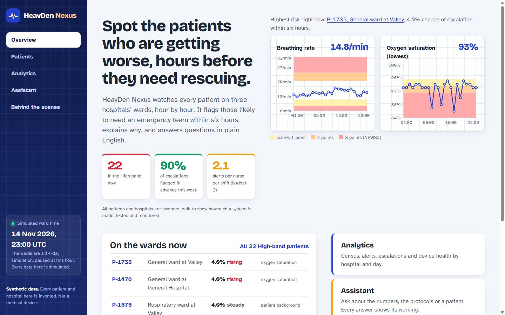
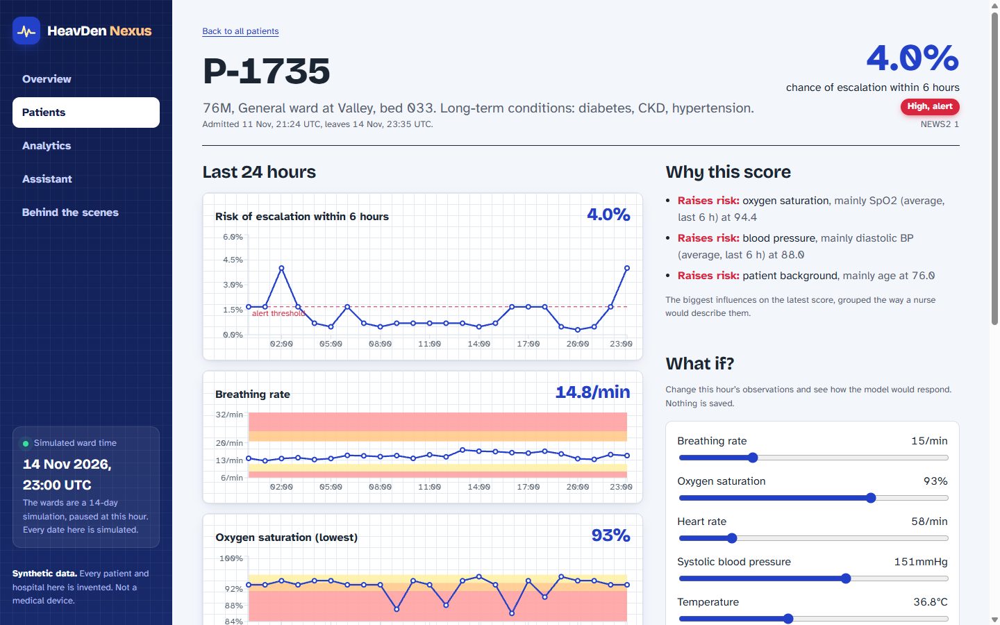
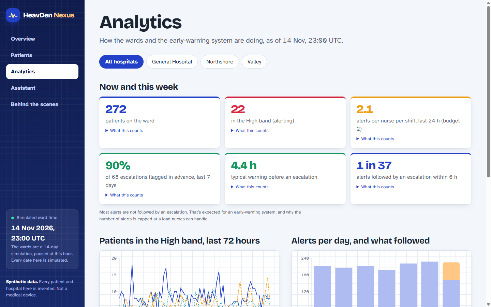
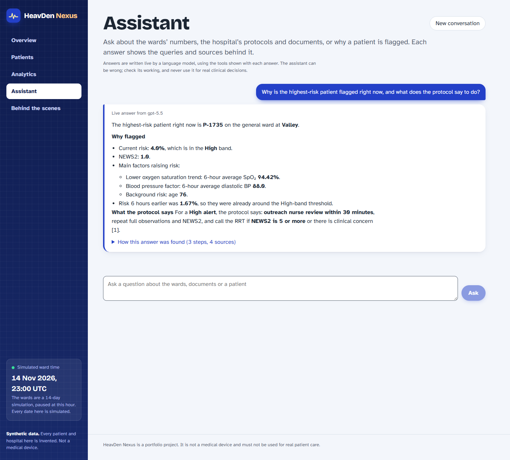
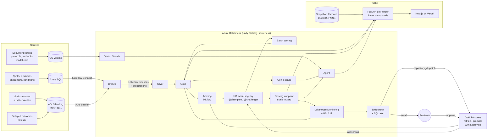

# HeavDen Nexus

**An early-warning system for hospital wards, built end to end: synthetic patients, a data platform, a risk model that has to beat the clinical standard, drift monitoring with human-approved retraining, an AI assistant, and a public web app.**

HeavDen Nexus watches every inpatient across three fictional hospitals, hour by hour. It estimates each patient's chance of needing an emergency team within the next six hours, raises a limited number of alerts a nurse can act on, explains each score in clinical terms, and answers questions about the wards in plain English, showing the queries and sources behind every answer.

> **Synthetic data only.** Every patient, hospital and document is invented. This is a portfolio project, not a medical device, and must not be used for real patient care.



## Where it stands

The project is built in phases. **Phase 0 (offline foundations) is complete**: everything below runs on a laptop, with no cloud spend. The Azure Databricks phases come next.

| Phase | Scope | Status |
|---|---|---|
| 0. Offline foundations | data generators, drift scenarios, features, model, evaluation, documents, API and web app in demo mode, learning notebooks, CI | **done** |
| 1. Data platform | Terraform, Azure SQL, Lakeflow Connect and Auto Loader into Bronze, Silver and Gold pipelines with expectations, Unity Catalog | next |
| 2. Model and serving | feature tables, MLflow on Unity Catalog (`@champion` / `@challenger`), batch scoring, a scale-to-zero serving endpoint | planned |
| 3. Monitoring and MLOps | Lakehouse Monitoring, PSI and Jensen-Shannon drift metrics, email alerts, retraining and promotion approved in GitHub Actions | planned |
| 4. AI assistant on Databricks | Genie, Vector Search and a Unity Catalog function behind one agent, gated by an MLflow evaluation set | planned |
| 5–6. Live app, then handoff | live mode for the app, then snapshots and teardown so the public demo outlives the cloud credits | planned |

## What's in it

**Believable synthetic data** (`generator/`)
- Patients from [Synthea](https://github.com/synthetichealth/synthea), placed in three hospitals with 360 beds; about 300 are admitted at any time, with admissions, transfers and discharges driven by events.
- A vital-signs simulator that reports every 5 minutes from bedside devices, keeping a patient's true physiology separate from what the sensor measures (noise, artefacts, dropouts, stuck sensors).
- A hidden outcome rule decides who deteriorates and when; vital signs worsen in the hours before. Nurses titrate oxygen and record consciousness, as on a real ward. Outcomes arrive about 6 hours late, as labels do in practice.
- Four drift scenarios from one config file: an SpO2 sensor bias after a firmware update at one site (data drift), a respiratory outbreak (abrupt drift), a protocol change that lowers the escalation threshold (concept drift), and devices that change their payload (schema drift).

**A model that has to earn its place** (`databricks/src/heavden/ml/`)
- A calibrated classifier for P(escalation within 6 h), not an anomaly score. Logistic regression and LightGBM compete; the winner must beat a full 7-parameter **NEWS2**, the score UK hospitals use, on the same alert budget.
- Time-based splits with gaps, point-in-time features, and alerts counted as alerts (a patient entering the High band, with 6-hour re-alert suppression), not as patient-hours.
- Each score comes with its reasons: exact SHAP contributions, grouped the way a nurse would describe them ("oxygen saturation", "blood pressure").

**An assistant that shows its working** (`backend/heavden_api/chat/`)
- One tool-calling agent with three tools: SQL over the gold tables, search over the hospital's documents (protocols, device manual, runbooks, model card) with citations, and a patient-risk lookup.
- LLM-written SQL is parsed and allow-listed, then run in a locked, read-only sandbox. Prompt-injection and data-leak defences sit before, inside and after the model. Answers stream as they are written and remember the conversation for follow-ups.

**A web app** (`web/`, `backend/`)
- Next.js on Vercel and FastAPI on Render. In demo mode the API serves a snapshot of the gold tables through DuckDB, using the same SQL the live Databricks mode will run.

| | |
|---|---|
|  |  |
|  | |

## Results so far (Phase 0, synthetic test period)

On a held-out 2-day test period with 28 escalations, with both scores limited to **at most 2 alerts per nurse per 12-hour shift**:

| | Model | NEWS2 |
|---|---|---|
| Escalations flagged in the 6 hours before | **25 of 28 (89%)** | 21 of 28 (75%) |
| Flagged at least 3 hours ahead | **19** | 12 |
| Alerts followed by an escalation | about 1 in 30 | about 1 in 30 |
| AUPRC (hourly ranking) | **0.40** | 0.22 |

The model flags 14 percentage points more deteriorating patients in advance (95% interval from an encounter-level bootstrap: +3 to +28). The data is synthetic, so these numbers show the method works, not how it would do in a real hospital; the model card (`docs/corpus/model-card.md`) covers performance by site, age, sex and COPD, and the known limitations.

## Architecture

The target platform on Azure Databricks. Phase 0 builds and tests each piece offline first: pandas reference implementations of the gold tables, a local MLflow registry, FAISS in place of Vector Search, and the app in demo mode.



Key decisions:
- **Serverless only, triggered runs, scale-to-zero endpoints**, to fit a $200, 30-day cloud budget. Dev and staging run only from CI, on small seeded data.
- **Model deployment is an alias swap** (`@champion`), never Model Registry stages.
- **Retraining and promotion need a human approval in GitHub Actions environments**, so the approval history stays in the repo after the cloud workspace is gone.
- **The public app is not a Databricks App** (those can't be public). It runs on Vercel and Render, and falls back to demo mode when the credits end.

## Run it locally

Requirements: Python 3.12 with [uv](https://docs.astral.sh/uv/), Node 22, and Java 17+ for Synthea.

```bash
uv sync --all-groups
uv run nbstripout --install --attributes .gitattributes   # once per clone
```

1. **Generate the data and the model** by working through the notebooks in `notebooks/local/` (01 runs Synthea, 05 builds the features, 06 trains and registers the champion, 08 builds the document index). Everything is written to `data/`, which is git-ignored.
2. **Build the demo snapshot and start the API:**
   ```bash
   uv run python backend/scripts/build_demo_snapshot.py
   uv run uvicorn heavden_api.app:app --port 8000      # http://127.0.0.1:8000/docs
   ```
   For live assistant answers, put `OPENAI_API_KEY=...` in a `.env` file at the repo root (git-ignored). Without a key, the assistant replays recorded answers.
3. **Start the web app:**
   ```bash
   cd web
   npm install
   npm run dev                                         # http://localhost:3000
   ```

Checks, as CI runs them on every pull request:

```bash
uv run ruff check . && uv run ruff format --check .
uv run pytest
cd web && npm run typecheck && npm run build
```

More detail: [`backend/README.md`](backend/README.md) (endpoints, assistant safety, configuration) and [`web/README.md`](web/README.md) (design).

## Learning notebooks

`notebooks/local/` walks through every step hands-on, importing the project's code rather than copying it, and each one ends with exercises.

| Notebook | Topic |
|---|---|
| 00 | setup and a tour of the repo |
| 01 | Synthea patients |
| 02 | the vital-signs simulator |
| 03, 03b | the hidden outcome rule; hospital activity and what an incremental load fetches |
| 04 | the drift scenarios |
| 05 | features and labels without leakage |
| 06 | NEWS2 and the first model |
| 07 | evaluation in depth: alert budgets, bootstrap intervals, fairness slices, explanations |
| 08 | the document corpus, chunking and retrieval |

## Repository layout

```
generator/              Synthea runner, hospital activity, vitals, outcomes, bedside care, drift
databricks/src/heavden/ Python package used locally now and on Databricks later:
  ml/                     features, NEWS2, training, evaluation, explanations, scoring
  analytics/              gold tables (pandas reference for the Spark pipelines)
  monitoring/             PSI and Jensen-Shannon drift metrics
  agent/                  document chunking, retrieval, SQL guard
backend/                FastAPI app (demo mode now, live mode later) and scripts
web/                    Next.js app
docs/corpus/            the hospital's fictional documents, searched by the assistant
notebooks/local/        learning notebooks
tests/                  unit tests
.github/workflows/      CI
```

## License

[MIT](LICENSE)
